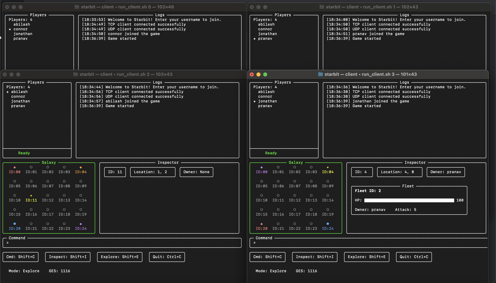

# 
# starbit `v0.01`
A lightweight, space RTS game played in the terminal using QUIC and gRPC.
Written fully in Go.

## 📚 Table of Contents
- [Game Overview](#game-overview)
- [How to Play](#how-to-play)
- [Controls](#controls)
- [Deployment](#deployment)
- [Roadmap](#roadmap)
- [Contributing](#contributing)

## Game Overview
`starbit` is a space real-time strategy game where 2-4 players compete to conquer a the galaxy. Each player controls an Empire and aims to gain control over the entire galaxy by building and moving fleets to battle opponents.

### How to Play
- Get 2-4 players together.
- The game updates every 500ms.
- Players begin with a starting System and a *Fleet*.

**GES**:
Players earn 2 GES (General Energy Substance) per tick. GES is used to create new Fleets, which cost 1000 GES each.

**Fleets**: All Fleets start with 100 health and 5 attack power.
- Create Fleets in systems you control.
- Combat resolves automatically when Fleets from different players occupy the same system.
- During combat, each ship randomly selects an enemy to attack and deals damage each tick.
- A player wins by eliminating all opposing Fleets and controlling all systems.

### Controls
- **Navigation**: Press `Shift+E` and use arrow keys to move around the galaxy.
- **Inspector**: Press `Shift+I` to open the inspector panel, and use arrow keys to scroll up and down.
- **Commands**: Press `Shift+C` to access the command line, where you can enter:
  - `fc <system>` - Create a new Fleet in the specified system
  - `fm <fleet id> <from system id> <to system id>` - Move a Fleet from one system to another

## Deployment
You'll need:
- AWS Account (Free Tier is fine)
- Terraform (or you can do it manually)

1. **Create a key-pair** in AWS Ohio (`us-east-2`). Download the `.pem` file and place it in `~/.ssh/starbit.pem`.

2. **Set up the infrastructure**:
   ```shell
   cd infrastructure
   terraform init
   terraform apply -var="key_name=starbit"
   ```

3. **Connect to the server**:
   ```shell
   ssh -i ~/.ssh/starbit.pem ubuntu@<IP>
   ```

### Option 1: Using Pre-built Server Executable (Recommended)

4. **Download and run the server directly** (recommended):
   ```shell
   # Create a directory for the server
   mkdir -p ~/starbit
   
   # Download the executable directly to the server
   curl -L https://github.com/connortbot/starbit/releases/download/v0.01/starbit-server-linux -o ~/starbit/starbit-server
   
   # Or alternatively with wget:
   # wget https://github.com/connortbot/starbit/releases/download/v0.01/starbit-server-linux -O ~/starbit/starbit-server
   
   # Make it executable
   chmod +x ~/starbit/starbit-server
   
   # Run the server
   ~/starbit/starbit-server
   ```
5. **Destroy the infrastructure** when done:
   ```shell
   terraform destroy -var="key_name=starbit"
   ```

### Option 2: Building from Source

4. **Clone the repository and set up the server**:
   ```shell
   git clone https://github.com/connortbot/starbit.git
   cd starbit
   chmod +x setup_server.sh
   ./setup_server.sh
   source ~/.bashrc
   chmod +x run_server.sh
   ./run_server.sh
   ```

5. **Destroy the infrastructure** when done:
   ```shell
   terraform destroy -var="key_name=starbit"
   ```

## Roadmap
- Add Ex(plosive) Attack, Evasion, and Armor.
- Ships (Destroyer, Cruiser, Battleship, Dreadnought) and Fleet composition of Ships.
- Build Supply System, requiring *Convoys* scaling with GES/tick consumption, and supply penalties.
- Combat Bonuses (outnumbering, ownership of system, etc.)

## Contributing
Contributions are welcome! Please open an issue or submit a pull request.
Contact me at (loiconnor8@gmail.com).