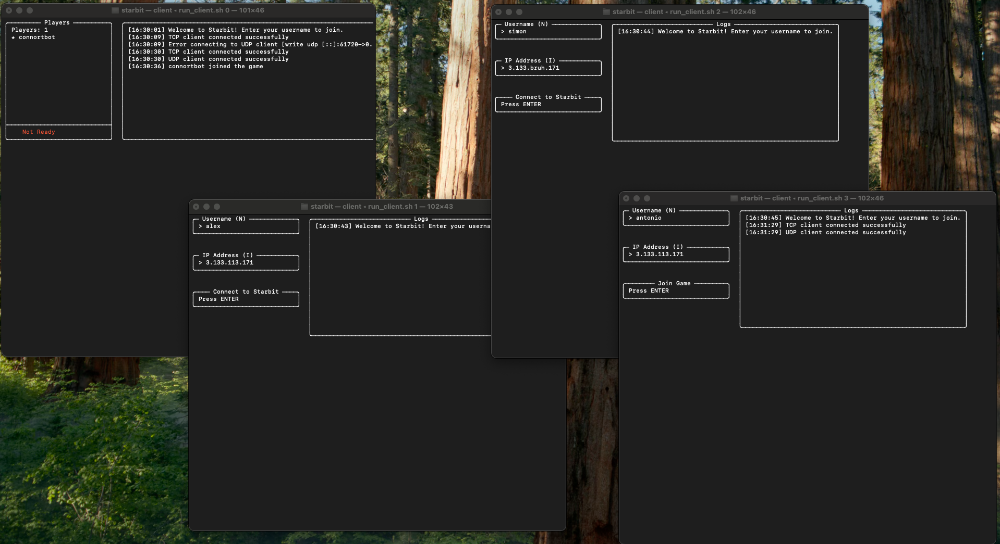

# Case Study
This explains the process of `starbit`, implementation along the way. (kinda a Case Study, not really)

### Initial Goals:
- Create a space strategy game in <5 days.
- Implement stats-heavy systems in battling, supply, resources.
- Real time, complete games in 10 minutes or less.
- Lightweight, in the terminal
- Learn `gRPC`!
- (Optional) Uses keystrokes to control.

## Initial Game Explanation
`starbit` takes 2-4 players per game. 
Each Player controls an respective Empire in a tiny, randomly-generated Galaxy. The Galaxy is made up of a grid of Systems. 

A Player wins by getting control over the entire Galaxy.

### Gameplay
Players begin at roughly 4 opposite ends of the Galaxy, each starting with 1 System, 1 Factory, and 1 Scout.
The game is updated in 5 second ticks. Players can perform as many actions as they want between each tick, and they all go simultaneously into effect in the next tick.

All actions by players can be divided into:
- Gaining resources
- Creating units
- Battling for control over Systems

The actions are performed via typing commands into the terminal.

#### Combat
Players move Fleets into Systems, which fight other enemy Fleets. During each tick, the Fleets will deal and take damage.
Once there is only one Player's Fleet remaining, that Player owns the Sector. 
Owning a Sector yields a 10% bonus to ALL stats.

Every Fleet has:
- Attack
- Ex Attack (high damage)
- Armor (weighted average % protection against Ex Attack)
- Evasion (weighted average % protection against Attack)
- Health (death upon 0, add more ships to increase)
Fleets are comprised of Ships, which can be added to Fleets thereby shifting the stats.

**Tick Resolution:**
1. Each Fleet rolls Evasion
2. Each Fleet chooses a random enemy Fleet and deals Attack. Mitigated by their Evasion.
3. Each Fleet then deals Ex Attack to the same Fleet. Mitigated by their Armor.
4. Every Fleet with Health <= 0, destroy.

Fleets receive a 50% penalty if they are not properly supplied. This leads us to...

#### Resources & Supply
There is only one currency in this game: General Energy Substance (GES).
Players build Factories, which generate GES/tick. GES is used to create Fleets, and all Fleets require spending of GES per tick.

Players must create Convoys. Each Convoy is able to 'supply' an amount of GES. 
**Example:** Jonathan spends around X GES/tick on Fleets. Each Convoy supplies around Y GES/tick. If Y < X, the Fleets get a supply penalty.
> Its important to note that Fixed costs (building Ships for Fleets, and Factories) don't contribute to Variable Costs (maintenance GES/tick)

Players can build an infinite amount of Factories. They are not located in Systems.


## Beginning
Started by creating a `gRPC` simple game service, where a server can send ticks every 5 seconds and clients can freely send messages.
Then added a lobby system, players can join and differentiated by username.

```
╭──── Starbit ────╮
│ Players: 1/2    │
├─────────────────┤
│ ★ bruh        
╰─────────────────╯

Press Ctrl+C to quit
```

For a very first, working version, I greatly simplified the core gameplay.
- No Supply system
- No GES or Factories
- No depth to Fleets, all same stats.

The biggest concern was the user experience. Originally, a Player would tens to hundreds of Ships individually managed. I wanted the gameplay to be keystroke heavy, but how could a player efficiently control over, say, 50 ships? 
A better way of designing this would be to lessen the amount of units that need to be controlled without sacrificing strategic depth in the stats.

> Instead of 50 ships, think of them as 3-5 Fleets! This is not only more realistic but easier to control.

### Basic UI
Added the ability to select cells and view a basic UI:
```
╭──── Starbit ─────╮
│ Players: 2/2     │
├──────────────────┤
│   connor1        │
│ ★ stella         │
├──────────────────┤
│      Ready       │
╰──────────────────╯

Galaxy Map:
■ □ □ □ □ □ □ □ □ □ 
□ □ □ □ □ □ □ □ □ □ 
□ □ □ □ □ □ □ □ □ □ 
□ □ □ □ □ □ □ □ □ □ 
□ □ □ □ □ □ □ □ □ □ 
□ □ □ □ □ □ □ □ □ □ 
□ □ □ □ □ □ □ □ □ □ 
□ □ □ □ □ □ □ □ □ □ 
□ □ □ □ □ □ □ □ □ □ 
□ □ □ □ □ □ □ □ □ ■ 

╭─ Command ────────────────────────────────────────────────╮
│ i love connor                                            │
╰──────────────────────────────────────────────────────────╯

Press Ctrl+C to quit
```
> courtesy of my girlfriend, also this is missing a lot of colours.
The next step is, since the cells is limiting in terms of information, to have anothe window to the right of the galaxy showing info of the selected cell.

This also means more UI custom functions to:
- wrap given string content in a box (splitting by lines, adding)
- placing boxes side by side

## Fleets
We initialize a basic Fleet type and some functions to spawn them in:
```protobuf
message Fleet {
  string owner = 1;
  int32 attack = 2;
  int32 health = 3;
}
```
And upon game start, we place 1 Fleet in the starting positions accordingly.

## User Controls
After some experimenting, I landed on having players:
- VIEW information with the Inspector
- CHOOSE information with the Galaxy Map, choosing the System
- ACTION with the Command line.

After basically creating a mini UI library from scratch to make the boxes and some keybinds to switch between modes, 

```
╭──── Starbit ─────╮
│ Players: 2/2     │
├──────────────────┤
│ ★ connortbot     │
│   pranavbedi     │
├──────────────────┤
│      Ready       │
╰──────────────────╯

╭─────── Galaxy ───────╮  ╭─────────────────────── Inspector ────────────────────────╮
│ ■ □ □ □ □ □ □ □ □ □  │  │ ╭────────╮ ╭──────────────────╮ ╭───────────────────╮    │
│ □ □ □ □ □ □ □ □ □ □  │  │ │ ID: 0  │ │ Location: 0, 0   │ │ Owner: connortbot │    │
│ □ □ □ □ □ □ □ □ □ □  │  │ ╰────────╯ ╰──────────────────╯ ╰───────────────────╯    │
│ □ □ □ □ □ □ □ □ □ □  │  │                                                          │
│ □ □ □ □ □ □ □ □ □ □  │  │ ╭──────────────────── Fleet ─────────────────────╮       │
│ □ □ □ □ □ □ □ □ □ □  │  │ │ HP: ██████████████████████████████████████ 100 │       │
│ □ □ □ □ □ □ □ □ □ □  │  │ │                                                │       │
│ □ □ □ □ □ □ □ □ □ □  │  │ │ Owner: connortbot    Attack: 10                │       │
│ □ □ □ □ □ □ □ □ □ □  │  │ ╰────────────────────────────────────────────────╯       │
│ □ □ □ □ □ □ □ □ □ ■  │  │                                                          │
╰──────────────────────╯  ╰──────────────────────────────────────────────────────────╯
╭─ Command ────────────────────────────────────────────────╮
│ >                                                        │
╰──────────────────────────────────────────────────────────╯

╭──────────────╮  ╭──────────────────╮  ╭──────────────────╮  ╭──────────────╮
│ Cmd: Shift+C │  │ Inspect: Shift+I │  │ Explore: Shift+E │  │ Quit: Ctrl+C │
╰──────────────╯  ╰──────────────────╯  ╰──────────────────╯  ╰──────────────╯

   Mode: Command
```
> again, no colours and idk why the formatting got cooked

## UDP vs TCP
A big consideration of this is - if this is a RTS, why are we not using something like QUIC? UDP is infinitely better suited to use cases where real time communication is important.

It adds a great deal of complexity but, maybe we can use gRPC for communication that is not low latency-dependent? Then, we can greatly increase the "real-time" effect of the game. The ticking would still remain, so for now we'll keep it at 5 seconds to keep it simple and minimize the effect of packet loss.

### Implementation
After some refactoring, I modified it so that TCP now is an open channel for general, admin changes (such as joining a game), whereas UDP is for rapid, game state changes.

#### TCP Client
We divide into `tcp-client.go` and `main.go`.
- `Connect()` creates a new gRPC connection to port 50051.
- `MaintainConnection()` opens a *stream* to receive updates from the server.
- `receiveUpdates()` continually receive messages from the server. 
The TCP client has a `tickCh` channel. `receiveUpdates()` sends it into here...
- `listenForTCPUpdates` continually receives from that channel. 

**Of course, we can combine `listenForTCPUpdates` and `receiveUpdates()`, which would remove the need for a `tickCh` in between. The only reason I decided against this is I think it makes more sense for `tcp-client.go` to be isolated from the BubbleTea framework. The same goes for UDP.
```
TCP Server → client.receiveUpdates() → tickCh channel → listenForTCPUpdates() → UI
  (network)        (in client)        (intermediate)      (in main app)        (UI)
```

#### TCP Server
- `MaintainConnection()` is called byt the client. We store streams as `map[string]<stream>`, keyed by username.
- `broadcastGameStart()` called immediately when we hit max players, notifies everyone of the initial Galaxy state.

#### UDP Client
Similarly `udp-client.go` and `main.go`.
- `Connect()` connects to QUIC server AND opens a stream AND begins listening for messages via `handleStream()`
- `Register()` this is called to send a `register` message to the server. I call it when the client joins the game. It notifies the server of `username`.
- `handleStream()` read data from stream, turn it into a TickMsg to send to the `tickCh`
- `listenForUDPTicks()` sends to BubbleTea from `tickCh`

Therefore, similarly, UDP:
```
UDP Server → client.handleStream() → tickCh channel → listenForUDPTicks() → UI
  (network)       (in client)        (intermediate)     (in main app)       (UI)
```
Another note is that UDP seems to rely on marshalling and unmarshalling JSON. This is a lot easier and more flexible (given that I can enforce type safety on both sides, we love Go!).

#### UDP Server
- `Start()` start broadcasting ticks, and accepts connections.
- `broadcastTicks()` sends out ticks to all client streams.

We also call direct gRPC functions like `JoinGame`.
I have a sneaking feeling this is all a bit disorganized...

## Better Galaxy Map
Boy, the Galaxy looks like it needs a polish, doesn't it?
Also, let's make it 5x5 as thats not only easier but makes the games less daunting.
We can also comfortably add a win condition that all systems need to be conquered to win.

> I should just images, huh?


## Moving Ships and Updating Clients


We allow the user to input commands. This sends a packet via UDP requesting to move the ship. If it works (otherwise, the server will send an error message back), the server will add it to its next tick message and update all clients simultaneously.

## Battles
Along with Battles, we just introduce not allowing users to move Fleets.
- If a Fleet is engaged in battle
- If a Fleet was moved during this tick already

Note that we don't actually need to establish complicated objects for Battles, we can just keep track of which Systems currently have Fleets from different owners, and thus are engaging in Battle. We can then just run calculations on those.

Then, we make a list of Fleet IDs who were moved this tick - and whenever a user tries to move it twice in one tick they will not be allowed.

```protobuf
message TickMsg {
  string message = 1;
  repeated FleetMovement fleetMovements = 2;
  repeated HealthUpdate healthUpdates = 3;
  repeated FleetDestroyed fleetDestroyed = 4;
  repeated SystemOwnerChange systemOwnerChanges = 5;
}
```

## Building Fleets
Now we want to add GES as a currency, and allow players to, for now, simply spend 500 GES on a new Fleet. We can do this with a:
```
fc <system_id>
```
And now we add:
```protobuf
  message TickMsg {
    ...
    repeated GESUpdate gesUpdates = 6;
    repeated FleetCreation fleetCreations = 7;
  }
```

## Logging History
I was having trouble tracking and seeing events come in, so I added a scrolling viewport that is updated by the tick processor on the client.


I then made some small updates to the Join Game screen.

## Win Condition
Here is time for some more consideration on how players win. Originally, and something I'm keeping right now, is a win is done by conquering every System in the Galaxy.

We start the server state with a map of usernames -> owned systems. We update this as the game goes along BUT, if any usernames array of owned systems hits a length of galaxy `width * height`, then we have a winner.

Upon this happening, we should:
1. Send a signal to all clients to show the win.
2. Terminate all connections, restart everything, clear all states to how it was in the beginning.
And on the client side,
3. Return to the Join Game screen and redo all the connections. Reset all state EXCEPT the logging window (to see the win message).

## Unique Colours
Currently, all the enemies are coloured red. Lets change that.


## Deploying And Joining Online Servers

I was able to deploy this using some simple terraform to set up a Ubuntu VM with exposed 50051 and 50052 ports. We then update the client to run with those IPs and bam:

> a very sad way to test. shows a player who has joined, a player who hasnt hit enter yet, a player who put the wrong IP, and a player who has connected to the server, but not joined.


## Deploying
Make a key-pair in Ohio (us-east-2). Download the pem and place it in `!/.ssh/starbit.pem`.

```shell
cd infrastructure
terraform init
terraform apply -var="key_name=starbit"

# And later
terraform destroy -var="key_name=starbit"
```

This will provide the server IP!

Then:
```shell
ssh -i ~/.ssh/starbit.pem ubuntu@<IP>
git clone https://github.com/connortbot/starbit.git
cd starbit

# Once inside the server
chmod +x setup_server.sh
./setup_server.sh
source ~/.bashrc
chmod +x run_server.sh
./run_server.sh
```

## Better Selection
We need to make it visually clear, with all of these different shortcuts, which window we have selected.

Let's make it so that a window glows green if it is selected. 
- **Join Menu**: Glow Username or IP Address green if its selected
- **Game Menu**: Glow Inspector, Galaxy Box, or Command Line.

And, lets just always have the ports as 50051 and 50052. This makes it easier on the user!

> I also had to add a pinging mechanism to keep the UDP connection alive. I had not implemented this before, and it cause stream timeouts.

And so after all that, we finally have a working version of `starbit`, complete with:
- game joining
- quick keybind combat
- pretty terminal ui
- using both gRPC and UDP!


## `v0.02` Update
I ended up running some beta test runs with friends, and it went well! I was really happy with how the high-pressure, rapid typing gameplay turned out to be. And, it was satisfying seeing things update in the screen.

For a `v0.02` update, I wanted to add some quick changes that would push the game from being a little bit stale to having just enough depth.
In `v0.01`, players are incentivized to just stack ships in one system. This means we should punish it by rewarding players who try to conquer area,
- Change the win condition so that someone can win without taking everything
- Get more GES per systems owned
- etc.

We also wantd to add some more strategy rather than the core gameplay being, "can you type fast enough to move the fleets". Thus, we should add a movement cooldown!

The resulting game ended having a surprising amount of depth for the minor nature of the changes. But a full game ended up having some real dimension to the gameplay. More thinking, more typing, and more fun!

The next thing to do in `v0.03` and `v0.04` would be to add *more combat depth and a supply system to make overscaling difficult*. After that, the game is pretty much done!


## `v0.03` Update
I'm back! After the v0.02 update, I had achieved my goal of making a working space strategy game fully in the terminal. But then I got a bout of excitement to work on this again, so I figured now was the time to add some depth with the **Combat Update**.

In `v0.02`, the biggest flaw was that there was no depth to the combat other than positioning and timing. I wanted to incentivize people to think about the *composition* of their fleets! At this point, I had already added this to the *Future Updates* list anyways.

The original goal was to create a sort of 'rock-paper-scissors' dynamic. I had already come up with our four ship types: Destroyer, Cruiser, Battleship, Dreadnought. But, I wanted to a strike a strategic balance where, yes, having the most resources and territory HELPS, but strategic fleet building can overcome deficits.

A good system will achieve the following:
- Cheaper to upgrade/modify fleets than it is to create new ones. This incentivizes have just a few fleets, making it less of a typing speed game and more of a strategy game.
- Every playstyle should have counterplay. Every fleet should have some way where a cheaper fleet can beat it.

The final mechanic:
- Each fleet is composed of Destroyers, Cruisers, Battleships, Dreadnoughts
- Add new stats Explosive Attack (Exattack), Evasion, and Armor.
- High cost to make new fleet, and charge GES to add a new ship to a fleet.

| Stat | Calculated With... | Boosted by |
|-|-|-|
| Health | Sum | Dreadnought > Battleship > Cruiser > Destroyer |
| Attack | Sum | Battleship > Dreadnought > Destroyer > Cruiser |
| ExAttack | Sum | Dreadnought > Battleship = Cruister > Destroyer |
| Evasion | % Avg | Destroyer > Cruiser > Battleship > Dreadnought |
| Armor | % Avg | Dreadnought > Battleship > Cruiser > Destroyer |

- Evasion is a percentage chance to avoid Attack
- Armor is damage reduction against both types ExAttack and Attack

I came up with the first set of stats:
| Ship | Cost | Health | Attack | Ex Attack | Evasion | Armor |
|-|-|-|-|-|-|-|
| Destroyer | 250 GES | 50 | 2 | 1 | 35% | 5% |
| Cruiser |  350 GES | 75 | 1 | 2 | 20% | 15% |
| Battleship | 800 GES | 200 | 5 | 2 | 10% | 30% |
| Dreadnought | 1500 GES | 600 | 3 | 5 | 5% | 40% |

**The Cycle(?):** Destroyer > Battleship > Cruiser > Dreadnought > Destroyer

Now that its implemented, its time to test.

